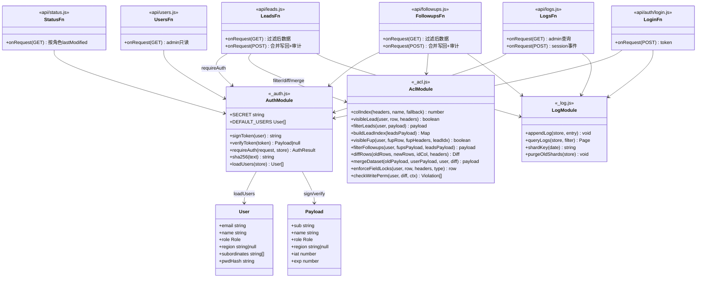
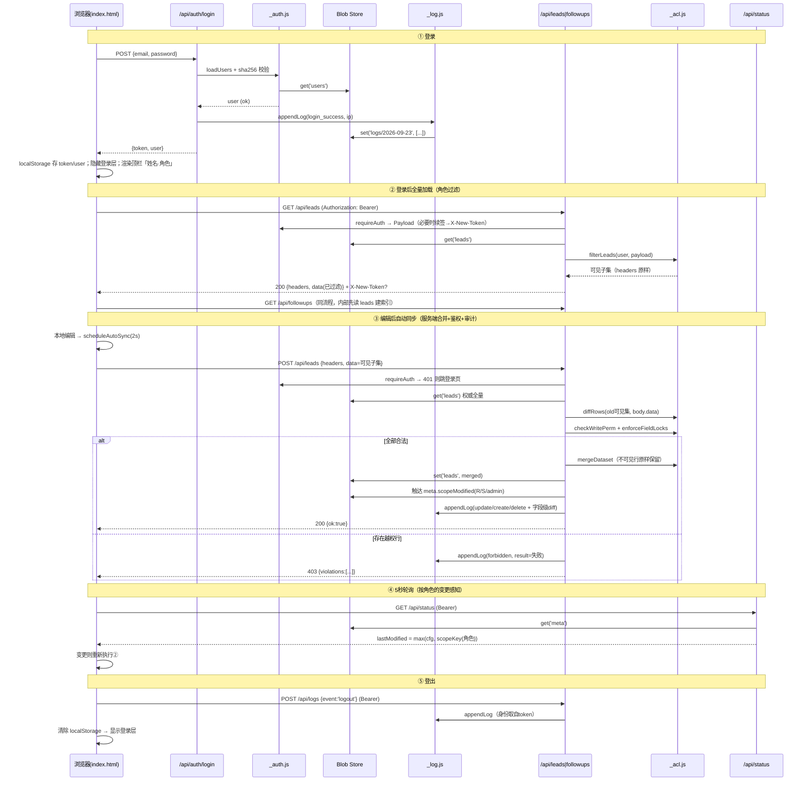
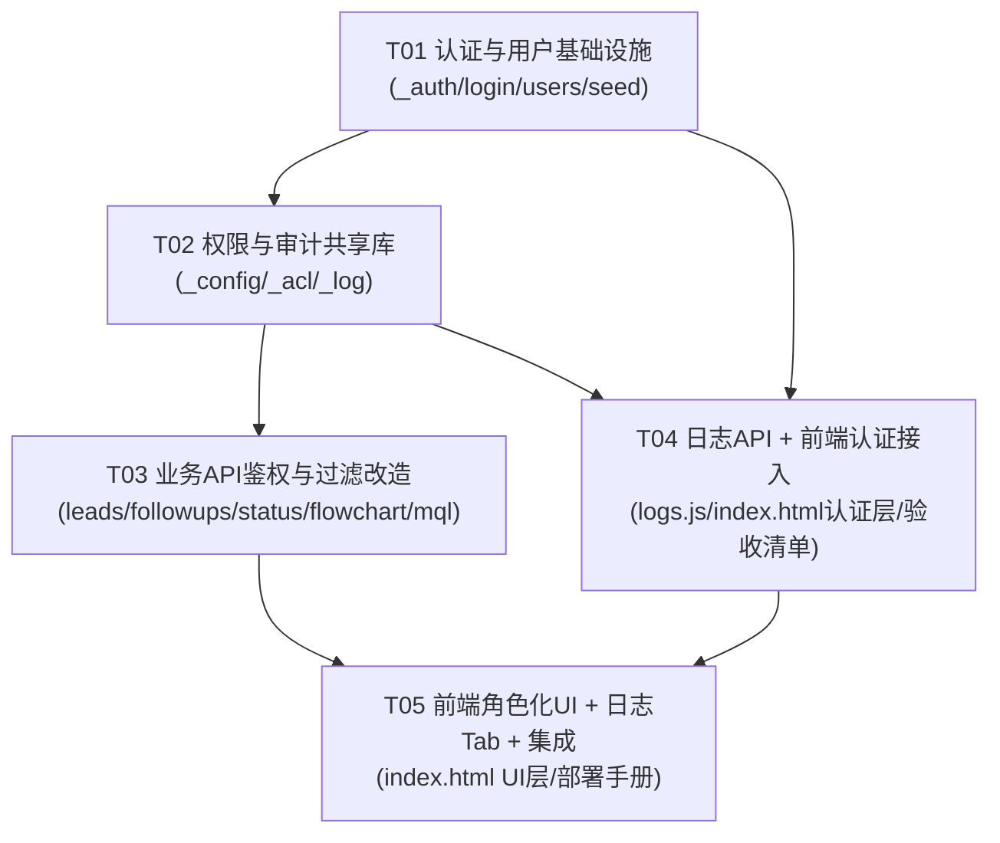

# 科诺美线索跟进系统 — RBAC 分级权限升级 系统架构设计

> 架构师：Bob（高见远） · 基于增量 PRD《rbac-upgrade-prd.md》 · 语言：中文
> 目标：单口令门禁 → 邮箱+密码三级账号体系；API 层行级数据过滤；写权限与字段锁定；审计日志。

---

## Part A：系统设计

### 1. 实现方案（Implementation Approach）

#### 1.1 现状关键约束（读代码确认）

| 现状 | 影响 |
|---|---|
| 前端单页 `index.html`（~77 万字符），数据全量加载进内存，编辑后 **POST 全量数据集覆盖写回**（body = `{headers, data}`） | **最重要的架构约束**：若 GET 按角色过滤后前端只持有子集，原样 POST 会把全量数据覆盖成子集，**直接毁掉其他大区的数据**。因此写接口必须改为「**服务端按行身份合并（merge）+ diff 校验**」，前端协议不变 |
| 边缘函数 `functions/api/*.js`（leads/followups/flowchart/mql/status），`@edgeone/pages-blob` 的 `getStore('chromai-leads')`，GET 读 + POST 写 | 不引入新框架；鉴权/过滤/日志做成 3 个共享模块 `_auth.js / _acl.js / _log.js`，各函数 import |
| 表头驱动动态列定位（`leadCol(name, fallback)` / `fupCol(...)`），用户可增删自定义列 | 服务端同样**禁止硬编码列索引**，`_acl.js` 内实现同名 `colIndex(headers, name, fallback)`；行数据按表头名映射后再合并 |
| 现有 POST 成功即更新 `meta.lastModified`（全局单值） | 升级为**按数据归属分片的 lastModified**（见 3.4），否则销售会被其他大区变更触发无效全量拉取 |
| Blob 已有 leads(2282)/followups(250) 线上数据 | 升级**只新增 Blob key（users、logs/*、meta 扩展字段），不改写 leads/followups 现有内容与结构** |

#### 1.2 核心技术挑战与对策

1. **全量覆盖写协议 × 行级过滤的矛盾** → 服务端「读旧全量 → 计算调用者可见集 → diff 入参子集 → 校验权限 → 合并回全量 → 写回」。前端零协议改动。
2. **无服务器会话状态** → HMAC-SHA256 自签名 token（JWT 风格，Web Crypto `crypto.subtle` 实现，边缘函数原生支持，零依赖）。
3. **fups 行归属需关联 leads** → 函数内先读 leads 建 `Map<线索编号, leadRow>`，250 × 2282 关联为 O(n) 查表，毫秒级，无性能压力。
4. **审计日志写放大** → 按日分片 key（`logs/YYYY-MM-DD`），追加=读当日数组+push+写回；业务量（13 用户、日操作百级）下完全可接受。
5. **密钥管理** → token 签名密钥走 EdgeOne 环境变量，前端代码零密钥（见 2.2）。

#### 1.3 架构模式

- **前端**：维持单页 vanilla JS，新增「会话层」（token 存储 + apiFetch 封装 + 401 拦截）与「角色 UI 层」（按 `currentUser.role` 渲染）。
- **后端**：边缘函数 + **共享模块分层**：
  - `_auth.js`（认证：签名/验签/密码哈希/用户加载）
  - `_acl.js`（授权：行归属判定、过滤、字段锁定、diff/merge）
  - `_log.js`（审计：追加/查询）
  - 业务函数只做「鉴权 → 调共享库 → 响应」的薄壳。
- **数据**：Blob KV，`leads` / `followups` / `flowchart` / `mql`（不动）、新增 `users`、`logs/*`、`meta.scopeModified`。

---

### 2. 关键架构决策

#### 2.1 用户存储（Blob key = `users`）

```json
{
  "users": [
    { "email": "yucui@chromai.com", "name": "于翠", "role": "admin", "region": null, "pwdHash": "<sha256hex>" },
    { "email": "tangxianyi@chromai.com", "name": "汤显义", "role": "region", "region": "汤显义",
      "subordinates": ["高丹枫","高雷","王泽","王远帅","黄江锐","胡雨来","汤显义"], "pwdHash": "<sha256hex>" },
    { "email": "wangyuanshuai@chromai.com", "name": "王远帅", "role": "sales", "region": "汤显义", "pwdHash": "<sha256hex>" }
  ]
}
```

- `pwdHash = sha256hex(email.toLowerCase() + ':' + password)`（per-user 哈希，为未来 P2「首次登录强制改密」预留；本期统一密码 chromai2019，种子时逐账号计算）。
- `region` 字段存**大区总姓名**（与 leads 行「负责大区」列的取值口径一致）。
- `subordinates` 仅 region 角色需要，**含本人**（大区总本人名下也允许有线索）。
- **初始化**：`seed-blob.js` 增加 users 种子逻辑（`node seed-blob.js users`，可重复执行、幂等——users 不存在才写入，避免覆盖管理员后续调整）；同时 `_auth.js` 的 `loadUsers()` 在 users 缺失时用内置默认清单**自愈初始化**（防部署顺序问题）。
- 13 个账号完整清单以 PRD 第 3 节为准（admin=于翠/汪琼/张欣；region=汤显义/管能/穆忠仁；sales=王远帅/高丹枫/黄江锐/王泽/胡雨来/高雷/刘力瑞；高雷在 PRD 表格中角色列为笔误，按 sales 处理）。
- 本期账号管理 = 只读展示（`GET /api/users`，仅 admin），编辑走配置变更。

#### 2.2 认证与会话

**Token 结构**（JWT 风格三段式，自行实现，不引库）：

```
base64url(header).base64url(payload).base64url(HMAC-SHA256(header.payload, SECRET))
header  = {"alg":"HS256","typ":"JWT"}
payload = {"sub":"<email>","name":"<姓名>","role":"admin|region|sales","region":"<大区总姓名|null>",
           "iat":<秒级时间戳>,"exp":<iat+7*86400>}
```

- **登录**：`POST /api/auth/login`，body `{email, password}`。邮箱 lowercase 后查 users → 校验 pwdHash → 签发 token。响应 `{ok:true, token, user:{email,name,role,region}}`。失败统一返回 401 `{ok:false,error:'邮箱或密码错误'}`（不区分邮箱不存在/密码错）。登录成功/失败均在**服务端直接写审计日志**（不依赖前端上报）。
- **前端存储**：`localStorage['chromai_token']` + `localStorage['chromai_user']`。
- **请求携带**：`Authorization: Bearer <token>`，统一走 `apiFetch()` 封装。
- **滑动续期**：`_auth.js` 验签时若**剩余有效期 < 3.5 天**，自动签发新 token，通过响应头 `X-New-Token` 下发；前端 apiFetch 检测到该头即替换 localStorage。无状态、无服务端会话表。连续 7 天未操作 → token 过期 → 401 → 跳登录页。
- **验签**：每个业务函数第一行 `const auth = await requireAuth(request, store)`；失败返回 401。HMAC 比较用定长比较（防时序攻击）。
- **密钥管理（决策）**：
  - **首选**：EdgeOne Pages 环境变量 `AUTH_SECRET`（控制台配置，函数内 `onRequest({request, env})` 取 `env.AUTH_SECRET`）。密钥不进代码库、不进前端。
  - **兜底**：`env.AUTH_SECRET` 缺失时回落到 `_auth.js` 内硬编码随机串（128-bit 随机生成，仅用于快速联调；代码注释醒目标注「生产必须配置环境变量」）。
  - 轮换密钥 = 全部 token 失效强制重登，可接受。
- **CORS 变更**：所有函数的 `Access-Control-Allow-Headers` 增加 `Authorization`；`Access-Control-Expose-Headers` 增加 `X-New-Token`（否则前端读不到续期头）。集中到共享常量。

#### 2.3 后端数据过滤（P0 红线：全部在 API 层执行）

`_acl.js` 核心函数（列定位一律按表头名）：

```js
colIndex(headers, name, fallback)          // 与前端 leadCol/fupCol 同语义
leadOwner(row, H)   = row[colIndex(H,'负责人',13)]  || ''
leadRegion(row, H)  = row[colIndex(H,'负责大区',14)] || ''
visibleLead(user, row, H)                  // 行归属判定
filterLeads(user, payload)                 // GET /api/leads 过滤
buildLeadIndex(leadsPayload)               // Map<线索编号trim/lower, row>
visibleFup(user, fupRow, fupH, leadIdx)    // 主规则关联+兜底
filterFollowups(user, fupsPayload, leadsPayload)
```

**规则**（与 PRD 第 3 节一致）：

| 角色 | leads | followups |
|---|---|---|
| admin | 全量 | 全量 |
| region | `负责大区 == 本人姓名` | 主：线索编号关联 leads 行后按 lead 归属；兜底：`负责人 ∈ subordinates ∪ {本人}` |
| sales | `负责人 == 本人姓名` | 主：关联 leads 行且 lead 负责人==本人；兜底：`负责人 == 本人` |
| 未分配（负责人/负责大区为空） | **仅 admin 可见**（假设，见「待明确事项」） | 同左 |

- 过滤**只裁剪 `data` 行，`headers` 原样返回**（前端列定位逻辑不破坏）。
- `GET /api/flowchart`、`GET /api/mql`：所有登录用户可读，不过滤；**POST 写这两个配置仅限 admin**（假设，见待明确事项）。
- MQLs Tab 数据即 followups，复用同一过滤；看板由前端基于已过滤数据集计算，天然口径一致，无需改统计代码。

#### 2.4 状态轮询：按角色的 lastModified（决策）

**问题**：现 `meta.lastModified` 为全局单值，A 大区改一行会触发 B 大区销售全量拉取（虽拉到的仍是过滤后数据，安全无虞，但 13 人 × 5 秒轮询 × 频繁全量拉取浪费带宽且造成 UI 抖动）。

**方案**：`meta.scopeModified` 分片时间戳：

```json
{ "admin": 1735000000000, "cfg": 1735000000000,
  "R:汤显义": 1735000000000, "S:王远帅": 1735000000000, ... }
```

- 写接口（leads/followups POST）完成 diff 后，对每个**变更/新增/删除行**触达：`admin`、`R:<该行负责大区>`、`S:<该行负责人>`（旧值与新值并集——改派场景双方都触达）；flowchart/mql POST 触达 `cfg`。
- `GET /api/status`：带有效 token 时返回 `lastModified` =
  - admin → `max(admin, cfg)`（admin 键任何写都触达，即全局）
  - region → `max(cfg, R:本人)`
  - sales → `max(cfg, S:本人)`
- 无 token：仅返回 `status/blobReady` 健康信息，不返回 lastModified（401 语义太重，健康检查保持 200）。
- 代价：每次写多算几个 key，O(变更行数)，可忽略。**收益**：销售只在自己数据或配置变化时拉取。

#### 2.5 写权限校验与服务端合并（P0，本设计核心）

**背景**：前端 POST body 仍是 `{headers, data}`，但 data 只是**该用户可见子集**。服务端处理流程（leads 为例，followups 同理）：

```
1. requireAuth → user
2. old = store.get('leads')                      // 线上全量（权威数据）
3. 计算 oldVisible = old.data 中 user 可见行集合（按旧数据判定可见性！防止他人刚改派导致的误判）
4. 以行身份（线索编号 trim().toLowerCase()）对齐 oldVisible 与 body.data：
   - in oldVisible & in body  → 逐字段 diff → update 候选
   - in oldVisible & !in body → delete 候选
   - !in oldVisible & in body → create 候选（新编号）或 越权（编号在 old 全量中存在但对该用户不可见）
5. 逐候选行权限校验 + 字段锁定（见下表）
6. 全部通过 → 合并：old 全量中 user 不可见行原样保留；可见行用 body 版本替换/删除；新行追加
   headers 合并 = old.headers ∪ body.headers（保序去重；行数组按表头名重映射对齐）
7. store.set('leads', merged)；触达 scopeModified；写审计日志（create/update/delete + 字段级 diff）
8. 任一候选行越权 → **整体原子拒绝** 403 {error:'forbidden', violations:[{id,field,reason}]}，记 forbidden 日志
```

**字段锁定规则（服务端强制覆盖/校验，不信任前端）**：

| 角色 | 「负责人」列 | 「负责大区」列 |
|---|---|---|
| sales | 允许值 = 本大区销售名单 ∪ {本人}（PRD 允许改派给同大区同事）；其余值 → 服务端强制改写为本人 | 强制改写为所属大区总姓名 |
| region | 允许值 = 本人 subordinates ∪ {本人}；越界 → 403 | 强制改写为本人姓名 |
| admin | 不限 | 不限 |

- **删除**：候选 delete 行必须属于 user 可见范围（sales 只能删本人行；region 只能删本大区行）。若现有前端无删除入口，该分支为预留（见待明确事项）。
- **行数为 0 的 body 特殊处理**：用户可见集为空时 body.data=[] 属合法（不触发任何 delete）。
- **并发**：行级 last-write-wins（现状即如此，13 人低并发可接受，记入共享知识）。
- followups 的身份列 = 「跟进编号」；归属判定复用 2.3 的主+兜底规则。
- **性能**：每次 POST = 2 次 Blob 读（leads+followups，fups 校验时需要 lead 索引）+ 1 次写 + O(n) diff，2282+250 行纯内存操作 < 50ms，无压力。

#### 2.6 审计日志

**存储**：Blob key `logs/YYYY-MM-DD`（UTC+8 当日），value 为 JSON 数组，元素：

```json
{ "ts": 1735000000000, "email": "...", "name": "...", "role": "sales",
  "event": "update", "objectType": "lead", "objectId": "LD-2026-0001",
  "diff": [{"field": "当前阶段", "old": "MQL", "new": "SQL"}],
  "result": "success", "ip": "1.2.3.4" }
```

- **事件枚举**：`login_success / login_failed / logout / create / update / delete / import / export / forbidden`
  - `login_success/login_failed`：由 `/api/auth/login` 服务端直接记录（防漏报）
  - `logout`：前端调 `POST /api/logs` 记录（body `{event:'logout'}`，服务端从 token 取身份，**忽略 body 中的身份字段**；该接口仅放行 logout/export 两类 session 级事件，防前端伪造数据类日志）
  - `create/update/delete/import`：**服务端在 POST 处理 diff 时生成**（防前端漏报）；import = 单次 POST 新增 ≥ 10 行时聚合为一条 import 事件（detail 含行数），否则逐行 create
  - `forbidden`：越权 POST 被拒时记录
- **IP**：`request.headers.get('x-forwarded-for') || request.headers.get('x-real-ip') || ''`（EdgeOne 边缘函数可用性待验证，取不到记空串——假设项）。
- **查询 API**：`GET /api/logs?from=YYYY-MM-DD&to=YYYY-MM-DD&email=&event=&page=1&pageSize=50`（仅 admin）。实现：按日期范围枚举分片 key → 读各片 → 合并 → 过滤 → 按 ts 倒序 → 分页。Blob list 能力若受限，则按日期范围逐日拼 key 直接 get（最多 31 天/次，超出截断并提示）。
- **保留策略（P1）**：`_log.js` 追加时惰性清理 12 个月前的分片（每天首次写入触发一次 list+delete），实现简单。

---

### 3. 数据结构与接口（classDiagram）



---

### 4. 程序调用流（sequenceDiagram）



---

### 5. 待明确事项（需用户/团队拍板）

1. **未分配线索**（负责人/负责大区为空）：默认仅 admin 可见可编辑，是否同意？
2. **flowchart/mql 配置的写权限**：默认仅 admin 可写（非业务数据但影响全员展示），其余角色只读，是否同意？
3. **销售改派**：PRD 默认允许销售改派给同大区同事（服务端按此实现），若不允许则 sales 的「负责人」列完全锁定为本人——请确认。
4. **删除入口**：现状前端若无删除 UI，delete 校验与日志按预留实现；是否本期为 admin 开放删除？
5. **IP 获取**：EdgeOne 边缘函数 `x-forwarded-for`/`x-real-ip` 可用性需联调验证，取不到则日志 ip 为空串。
6. **登录失败锁定**（5 次锁 15 分钟）按 PRD 列为 P2，本期不实现——统一密码场景下爆破风险真实存在，建议下期优先。
7. **AUTH_SECRET 环境变量**：需要部署时在 EdgeOne 控制台手工配置；未配置则用代码内兜底密钥（安全性降级）。
8. **日志分片按 UTC+8 日界**：查询日期范围同样按东八区解释，确认无误。

---

## Part B：任务分解

### 6. 依赖包（Required Packages）

```
- @edgeone/pages-blob@latest: 现有依赖，不变（Blob KV 读写）
（无新增第三方包——HMAC/SHA-256 用边缘运行时内置 Web Crypto crypto.subtle 实现）
```

### 7. 任务列表（按依赖排序）

| Task ID | 任务名 | 涉及文件 | 依赖 | 优先级 |
|---|---|---|---|---|
| **T01** | 认证与用户基础设施 | `edgeone/package.json`（scripts 补 seed:users）、`edgeone/seed-blob.js`（users 种子，幂等）、`edgeone/functions/api/_auth.js`（token 签发/验签/续签、sha256、loadUsers+自愈初始化、DEFAULT_USERS、共享 CORS 常量）、`edgeone/functions/api/auth/login.js`（POST 登录+登录日志）、`edgeone/functions/api/users.js`（GET，admin 只读账号清单） | — | P0 |
| **T02** | 权限与审计共享库 | `edgeone/functions/api/_config.js`（角色枚举、大区→下辖销售映射、表头名常量「负责人/负责大区/线索编号/跟进编号」、日志事件枚举）、`edgeone/functions/api/_acl.js`（列定位、行归属、过滤、diff、merge、字段锁定、越权校验）、`edgeone/functions/api/_log.js`（appendLog/queryLogs/分片/惰性清理） | T01 | P0 |
| **T03** | 业务 API 鉴权与过滤改造 | `edgeone/functions/api/leads.js`（GET 过滤 + POST 合并写回/校验/审计/scopeModified）、`edgeone/functions/api/followups.js`（同上，关联 leads 归属）、`edgeone/functions/api/status.js`（按角色 lastModified）、`edgeone/functions/api/flowchart.js`（鉴权 + 写限 admin + cfg 触达）、`edgeone/functions/api/mql.js`（同 flowchart） | T01, T02 | P0 |
| **T04** | 日志 API + 前端认证接入 | `edgeone/functions/api/logs.js`（GET admin 查询/筛选/分页 + POST session 事件）、`edgeone/index.html`（登录层替换 #pwdOverlay：邮箱+密码双输入框调 /api/auth/login；apiFetch 封装：自动带 Bearer、捕获 X-New-Token、401 统一跳登录；顶栏「姓名·角色」+退出按钮；loadAllData/轮询/scheduleAutoSync 全部改走 apiFetch；旧 chromai2019 口令逻辑删除）、`deliverables/rbac-acceptance-checklist.md`（QA 验收清单：13 账号 × 3 角色数据范围用例、字段锁定用例、越权用例、日志用例） | T01, T02 | P0 |
| **T05** | 前端角色化 UI + 日志 Tab + 集成 | `edgeone/index.html`（销售角色负责人筛选器隐藏/禁用；编辑弹窗负责人/负责大区按角色裁剪下拉与禁用；新增「日志」Tab 仅 admin 渲染：筛选条+倒序表格+分页；账号配置只读展示区；导出行为记 export 日志）、`deliverables/rbac-deploy-runbook.md`（部署/回滚手册：seed users → 配置 AUTH_SECRET → `edgeone makers deploy . -n chromai-leads -e production` → 冒烟步骤 → 回滚=重部旧版 index.html 与函数，Blob 数据不动） | T03, T04 | P0 |

> 说明：`index.html` 为单文件巨型前端，T04/T05 按「认证接入层」与「角色 UI 层」两个独立切面分工，修改区域不重叠（T04：登录层/请求封装/顶栏/数据加载；T05：Tab 渲染/编辑弹窗/筛选器/日志页）。

### 8. 共享知识（跨文件约定）

- **角色枚举**：`role ∈ {'admin','region','sales'}`（token payload、users、日志统一使用）。
- **大区映射**（`_config.js` 单一事实源，与 users 表 subordinates 保持一致）：
  - 汤显义大区（负责大区值=`汤显义`）：高丹枫/高雷/王泽/王远帅/黄江锐/胡雨来/汤显义
  - 管能大区（值=`管能`）：管能/刘力瑞
  - 穆忠仁大区（值=`穆忠仁`）：穆忠仁
- **关键表头名**：leads「线索编号(0)/负责人(13)/负责大区(14)」、followups「跟进编号(0)/线索编号(1)/负责人(13)」——括号内仅为 fallback，**一律按表头名定位**。
- **「负责大区」列存的是大区总姓名**（不是"华东/华南"式区域名）。
- **日志事件枚举**：`login_success / login_failed / logout / create / update / delete / import / export / forbidden`；objectType ∈ `{lead, fup, session}`；result ∈ `{success, fail}`。
- **Blob keys**：`users`、`logs/YYYY-MM-DD`（UTC+8）、`meta.scopeModified` 结构 `{admin, cfg, "R:<大区总姓名>", "S:<销售姓名>"}`。**绝不改写 leads/followups 既有结构**。
- **HTTP 约定**：401=未认证/过期（前端跳登录）；403=越权（body 含 violations）；业务响应保持现有 `{headers,data}` 形状，不引入 `{code,data,message}` 包装（避免大面积改前端）。
- **CORS**：`Allow-Headers: Content-Type, Authorization`；`Expose-Headers: X-New-Token`。
- **时间戳**：日志 ts 用毫秒 epoch（Date.now()），展示层转 UTC+8；token iat/exp 用秒。
- **写合并语义**：服务端以行身份（编号 trim+lower）合并；调用者不可见行永远以服务端旧值为准；headers 并集保序；行级 last-write-wins。
- **前端协议不变**：POST 仍发全量（自己可见的）`{headers, data}`，合并/裁剪全部在服务端。

### 9. 任务依赖图



T03 与 T04 在 T02 完成后可并行；T05 汇合收尾。
